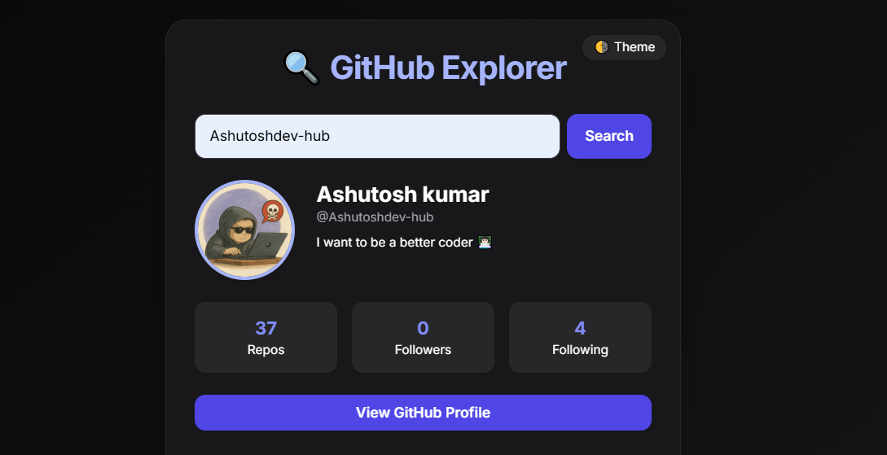

# GitHub Explorer

A modern, responsive web application to explore GitHub user profiles with a beautiful UI and smooth animations.



## 🚀 Features

- Search GitHub users by username
- Real-time profile data fetching
- Display user information including:
  - Profile picture
  - Bio
  - Public repositories count
  - Followers and following count
  - Recent repositories
- Dark/Light theme toggle
- Smooth GSAP animations
- Responsive design
- Glass morphism UI effects

## 🛠️ Technologies Used

- HTML5
- Tailwind CSS
- JavaScript (Async/Await)
- GSAP (Animations)
- GitHub API
- Glass Morphism Effects

## 📁 Project Structure

```
/
├── index.html      # Main HTML file with UI structure
├── Async.js        # JavaScript logic and API calls
└── README.md       # Project documentation
```

## 🔧 Setup & Installation

1. Clone the repository:
```bash
git clone <repository-url>
```

2. Open `index.html` in your browser or use a local server:
```bash
npx live-server
```

## 🎯 How It Works

1. **User Input**: Enter a GitHub username in the search field
2. **API Calls**: The app makes two API requests:
   - Fetch user profile data
   - Fetch user's recent repositories
3. **Data Display**: Displays user information in a clean, modern interface
4. **Animations**: GSAP animations enhance the user experience

## 🔍 API Endpoints Used

- User Profile: `https://api.github.com/users/{username}`
- User Repos: `https://api.github.com/users/{username}/repos?sort=updated&per_page=5`

## 🎨 UI Features

### Light/Dark Theme
- Toggle between light and dark modes
- Persists user preference
- Smooth transition effects

### Animations
- Page load animations
- Search results fade-in
- Repository list stagger effect
- Loading spinner animation

### Responsive Design
- Mobile-first approach
- Glass morphism effects
- Flexible grid layout
- Optimized for all screen sizes

## 🧰 Development

### CSS Classes Structure
```css
.glass {
    backdrop-filter: blur(12px);
    background-color: rgba(255, 255, 255, 0.15);
}
```

### JavaScript Functions
- `toggleTheme()`: Handles theme switching
- `getUserData()`: Fetches and displays user data
- GSAP animations for smooth transitions

## ⚠️ Error Handling

- User not found
- API rate limiting
- Network errors
- Empty username validation

## 🔒 Rate Limiting

GitHub API has rate limiting:
- Unauthenticated: 60 requests per hour
- Authenticated: 5,000 requests per hour

## 🤝 Contributing

1. Fork the repository
2. Create your feature branch
3. Commit your changes
4. Push to the branch
5. Open a pull request

## 📝 License

This project is open source and available under the [MIT License](LICENSE).
